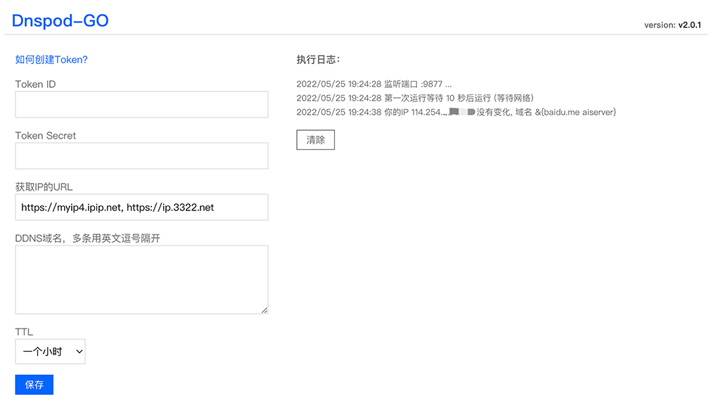

# dnspod-go

 

DDNS 获得你的公网IPv4，并提交到DNSPOD

## 动机

- `copy`自[ddns-go](https://github.com/jeessy2/ddns-go)项目,因为要改动很多东西，所以没有走fork
- 为了学习 golang、github actions、docker
- v1 在ddns-go的基础上做功能精简，只保留满足自己需要的， 主要是为了练手 2022-05-21
- v2开始做项目级别的refactor

## 特性

- **只**支持从外部网站获得ip v4版本并通过api修改 **DNSPOD** 的域名解析
- 项目依赖更小，优化go:embed使用
- 配置更简单， `-f`就是程序的执行频率，默认1小时检查一次
- 去掉配置页面外部框架依赖，体积更小
- 升级到最新的1.18版本，并与golang新版本保持同步

## TODO
- [x] 项目级别代码refactor 去掉本地比较5次再强制更新的策略
- [x] refactor web page 用 ~~vue3.2~~ 纯原生的html+css+js实现,去掉了jquery、bootstrap依赖
- [ ] bump to go1.18

## Docker中使用

- 在浏览器中打开`http://主机IP:9877`，修改您的配置

挂载卷
```bash
docker run -d --name dnspod-go --restart=always --net=host -v /opt/dnspod-go:/root airene/dnspod-go
```

支持启动带参数 `-l`监听地址 `-f`间隔时间(秒)

```bash
docker run -d --name dnspod-go --restart=always --net=host airene/dnspod-go -l :9877 -f 600
 ```

## 界面



## 开发&自行编译

- 如果喜欢从源代码编译自己的版本，可以使用本项目提供的 Makefile 构建
- 使用 `make build` 生成本地编译后的 `dnspod-go` 可执行文件
- 使用 `make build_docker_image` 自行编译 Docker 镜像
